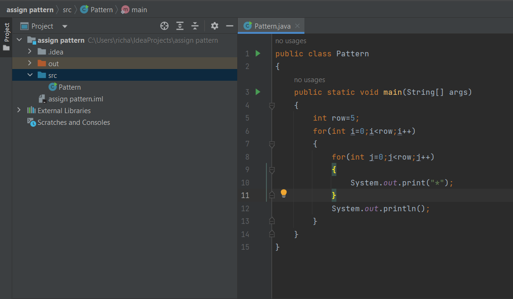
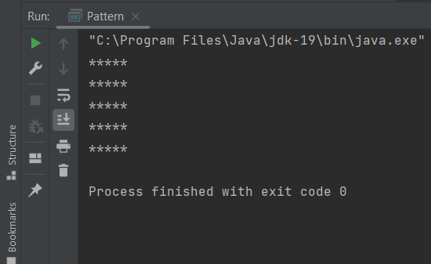
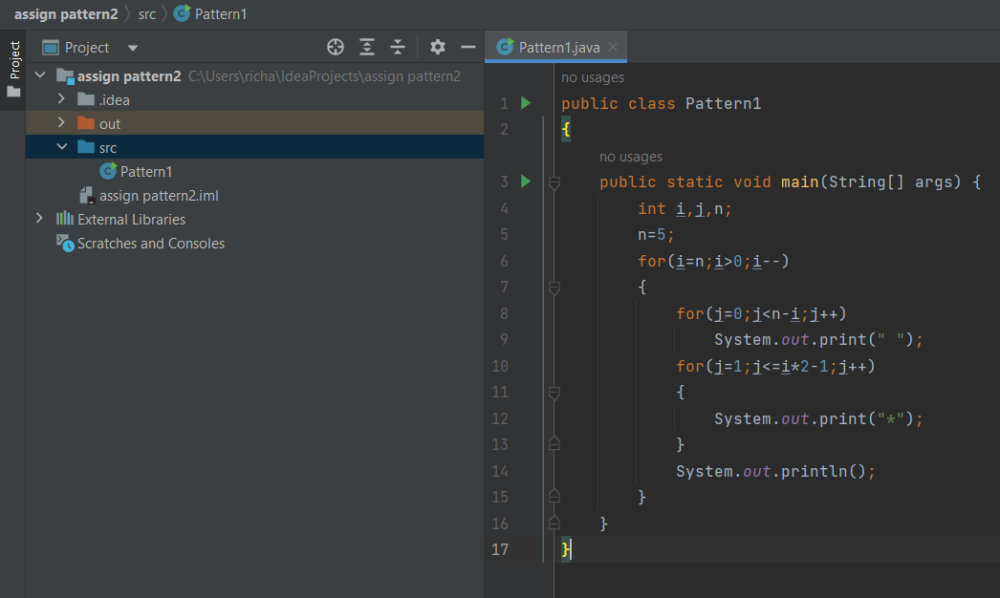
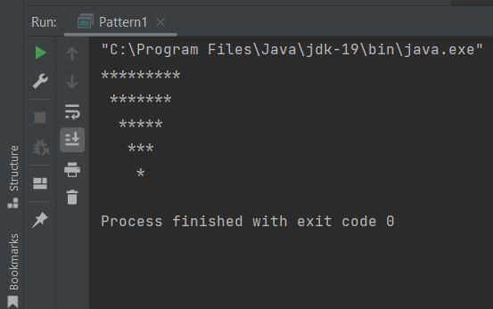
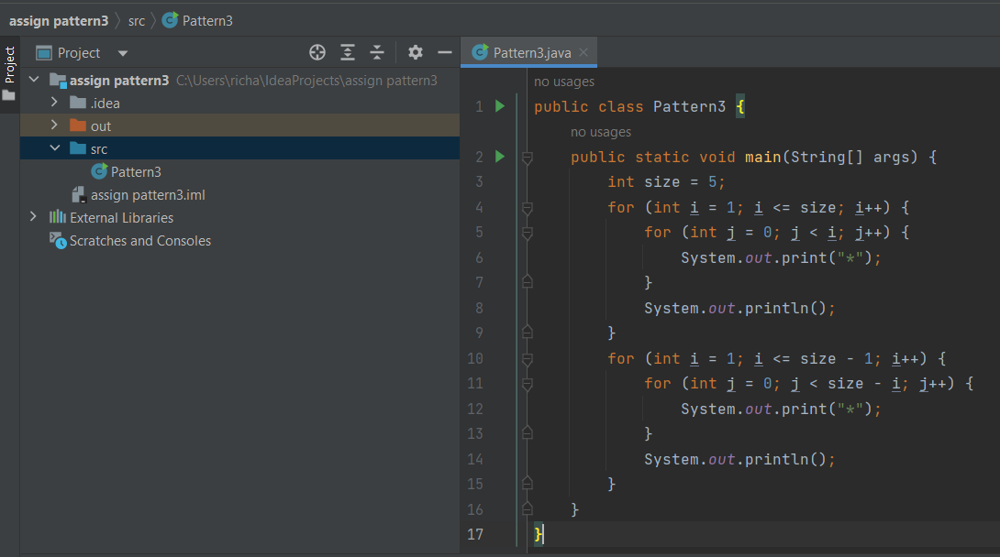
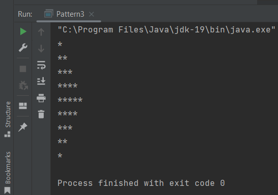

# Java-Pattern-Assesment...

### #1. Java program to create programme for the given pattern:

    *****
    *****
    *****
    *****
    *****
                       
```java
//Java program to create programme for the given pattern....

public class Pattern
{
    public static void main(String[] args)
    {
        int row=5;
        for(int i=0;i<row;i++)
        {
            for(int j=0;j<row;j++)
            {
                System.out.print("*");
            }
            System.out.println();
        }
    }
}

```

### Program screenshot:



### Output screenshot:




### #2. Java program to create programme for the given pattern:

    *********
     *******
      *****
       ***
        *

                       
```java
//Java program to create programme for the given pattern....

public class Pattern1
{
    public static void main(String[] args) {
        int i,j,n;
        n=5;
        for(i=n;i>0;i--)
        {
            for(j=0;j<n-i;j++)
                System.out.print(" ");
            for(j=1;j<=i*2-1;j++)
            {
                System.out.print("*");
            }
            System.out.println();
        }
    }
}

```

### Program screenshot:



### Output screenshot:




### #3. Java program to create programme for the given pattern:

    *
    **
    ***
    ****
    *****
    ****
    ***
    **
    *

                       
```java
//Java program to create programme for the given pattern....

public class Pattern3 {
    public static void main(String[] args) {
        int size = 5;
        for (int i = 1; i <= size; i++) {
            for (int j = 0; j < i; j++) {
                System.out.print("*");
            }
            System.out.println();
        }
        for (int i = 1; i <= size - 1; i++) {
            for (int j = 0; j < size - i; j++) {
                System.out.print("*");
            }
            System.out.println();
        }
    }
}

```

### Program screenshot:



### Output screenshot:



